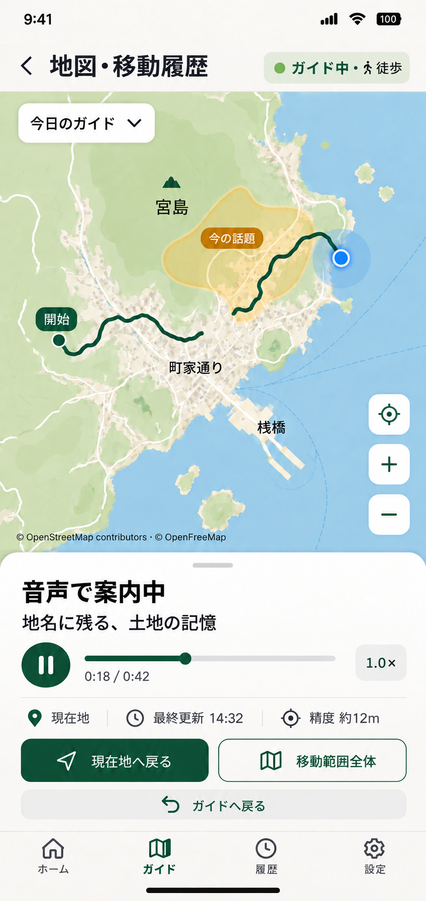

# LocalVoice

**現在地・移動状況・ユーザーの興味を理解して、「今ここで知ると面白いこと」を届ける位置情報AIガイド。**

LocalVoice は、一般的な観光スポット検索アプリではありません。

スマートフォンの位置情報、移動方向・速度、時間、天候、ユーザーの趣向や知識、同行者、直前の会話などを組み合わせ、AIが **「今、この人に、この場所で何を伝えると面白いか」** を判断し、文字・通知・音声で届けることを目指します。

## コンセプト

旅行や散歩で訪れる土地には、建物、地形、川、山、地域の植物、路地、食文化、地域産業などにまつわる多くの知識があります。しかし、その土地について知らないことは検索するきっかけも得にくいものです。

LocalVoice は、**現在地・移動状況と事前に用意した地域の知識をもとに、その場所にいるからこそ面白い話を届ける**ことを狙っています。

初期版はカメラや画像認識を使いません。GPS等で推定した位置・移動状況から話題を選び、ユーザーの目の前に何があるか、何が見えているかは判断しません。地域の特徴や対象物との位置関係を案内し、ユーザー自身が周囲に気づくきっかけを作ります。

**検索するほどではないけれど、聞くと面白い土地の小話が豊富に届くこと**を体験の中心にします。名所以外の食、方言、地名、暮らし、産業、自然も扱い、たくさん聞きたい人が満足できる話題の量と種類を用意します。学校の沿革だけの説明や、今の土地との関係が薄い過去ニュースで通知数を埋めません。

話題の選び方、話すタイミング、頻度に加え、**長く聞き続けたくなる声・抑揚・間・地名の読み**もMVPの品質要件にします。

## 技術構成

| 領域 | 技術 |
| --- | --- |
| モバイル | Flutter |
| 対応OS | Android / iOS |
| APIサーバー | Python / Flask |
| Database | PostgreSQL |
| 地理情報 | PostGIS |
| AI | Claude API（実行時の選択・語り、未準備地域の知識生成） |
| 音声 | 高品質TTSを比較試聴して選定。事前生成・音声キャッシュ＋必要時の生成、端末TTSは代替手段 |
| 認証 | Googleログイン / Appleログイン / ID・パスワード |

距離計算、速度・方向判定、候補抽出、通知間隔、重複排除、興味スコア等は通常のプログラムで処理し、「今どれを話すか、黙るか」と状況に合わせた語り、事前準備のない場所の知識生成にLLMを利用します。

## 最初の目標

年末の実旅行でドラフト版を使用し、まず **「位置情報に合わせて、知らなかった話が届く体験は本当に面白いか」** を検証します。

実際に旅行する地域はKnowledgeItemを事前準備して体験品質の基準とし、それ以外の場所では実行時にLLMで出典付きの知識を生成します。全ユーザーの全旅行先を事前に作ることはできないため、実行時のLLMは最初から組み込みます。

## ドキュメント

### Product
- [LocalVoice 仕様ドラフト v0.1](docs/product-spec-v0.1.md)
- [実装方式・実現性検討 v0.1](docs/implementation-feasibility-v0.1.md)
- [実装実現性 2回目レビュー記録 v0.1](docs/implementation-review-log-v0.1.md)

### MVP Technical Design
- [MVP 技術設計 v0.1](docs/mvp-technical-design-v0.1.md)
- [Database設計 v0.1](docs/database-design-v0.1.md)
- [API設計 v0.1](docs/api-design-v0.1.md)
- [Flutter画面・UX設計 v0.1](docs/flutter-ux-design-v0.1.md)
- [地図方式の比較検討 v0.1（推奨案）](docs/map-provider-comparison-v0.1.md)
- [認証設計 v0.1](docs/authentication-design-v0.1.md)
- [リアルタイムLLM設計 v0.1](docs/realtime-llm-design-v0.1.md)
- [土地の小話・コンテンツ品質方針 v0.1](docs/content-quality-policy-v0.1.md)
- [音声品質・TTS比較と設計 v0.1](docs/voice-design-v0.1.md)

### Screen Concepts
- [全16画面の画像・更新内容](docs/ui/README.md)
- [拡大表示できる画面一覧HTML](docs/ui/index.html)（ローカルで開く）

ガイド画面は上部に地図、下に小話・音声操作・選択式コマンドを配置。詳細表示では地図を縮め、全画面地図でも音声操作を継続するデザイン案です。

 
- [TTSサービス料金比較・有料ユーザーの音声選択案 v0.1](docs/tts-service-comparison-v0.1.md)

## MVP方針

- PostgreSQL + PostGISをMVPから利用
- Google・Apple・ID／パスワードの3方式をMVPから用意し、個人データは本人だけが取得・変更できるようにする
- 高品質音声の比較試聴をMVPに含め、静的原稿の事前生成・キャッシュで原価と待ち時間を抑える
- GPS生データを毎秒サーバー送信しない
- 現在地とガイドセッション中の移動履歴を地図表示する
- 実行時のLLM（候補の選択・語り、未準備地域の知識生成）を最初から組み込む
- 候補抽出・cooldown・重複排除はルールで行い、LLMの障害・遅延時はルール結果へフォールバックする
- LLMには出典付きの素材だけを渡し、主張ごとの出典をサーバーで検証する
- 全通知判定でルール1位とLLMの選択を記録し、同じ旅行のデータで比較できるようにする
- バックグラウンド位置情報は「ガイド開始中」だけ利用
- 英語KnowledgeItemは可能な限り事前生成
- 土地の小話の面白さ・量・種類、声の聞き心地、通知頻度をPoCの中心評価対象にする

## 要検討・PoC項目

- 1人が8時間旅行した場合のAPI原価
- バックグラウンドGPSとバッテリー消費
- 通知頻度と「うるささ」の最適化
- 移動状態・進行方向推定精度
- 情報源と信頼性評価
- 日本語/英語の体験品質
- 日英TTSの自然さ、地名の発音、長時間の聞き心地、生成待ち時間
- 位置情報・履歴のプライバシー設計
- 課金方式

## Status

**MVP technical design / Prototype planning**

仕様の実現性レビューを完了し、DB・API・Flutter UXを含む年末PoC向けMVP設計へ移行しています。
