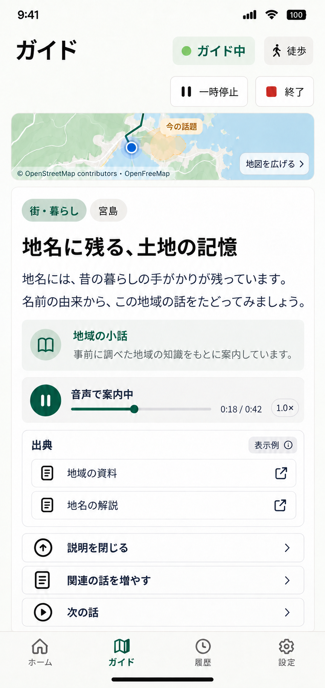

# LocalVoice 画面イメージ v0.2

更新日: 2026-10-06。組み込みImageGenで生成した画面案。MVP 14画面＋P1 2画面。PNGと生成プロンプトをこのフォルダーに保存しています。

## 更新内容

- ガイド: 上部に現在地・移動履歴・今の話の地域を示す地図、下に小話・再生状態・選択式コマンド。
- 詳細: 地図を小さなプレビューに縮め、本文と出典を読みやすく表示。
- 全画面地図: 音声再生/停止・速度表示とガイドへ戻る操作を追加。
- 設定: 声の試聴・再生速度・通信断時の端末読み上げの設定を追加。

  

## 画面一覧

| PNG | 画面 | 範囲 | 今回の更新 |
|---|---|---|---|
| [01-login.png](01-login.png) | ログイン | MVP | |
| [02-register.png](02-register.png) | ID新規登録 | MVP | |
| [03-password-recovery.png](03-password-recovery.png) | パスワード再設定依頼 | MVP | |
| [04-password-new.png](04-password-new.png) | 新しいパスワード設定 | MVP | |
| [05-home.png](05-home.png) | ホーム・ガイド開始 | MVP | |
| [06-guide.png](06-guide.png) | 地図付き音声ガイド | MVP | 更新 |
| [07-guide-detail.png](07-guide-detail.png) | ガイド詳細・出典 | MVP | 更新 |
| [08-map.png](08-map.png) | 現在地・移動履歴・音声操作 | MVP | 更新 |
| [09-history.png](09-history.png) | 今日知ったこと・履歴 | MVP | |
| [10-preferences.png](10-preferences.png) | 興味・ガイド・音声設定 | MVP | 更新 |
| [11-account.png](11-account.png) | アカウント・ログイン方法 | MVP | |
| [12-account-actions.png](12-account-actions.png) | パスワード変更・本人確認 | MVP | |
| [13-participants-p1.png](13-participants-p1.png) | 同行者設定 | P1 | |
| [14-temporary-command-p1.png](14-temporary-command-p1.png) | 一時的なガイド指示 | P1 | |
| [15-email-verification.png](15-email-verification.png) | 復旧用メール登録・確認 | MVP | |
| [16-account-deletion.png](16-account-deletion.png) | アカウント削除の確認 | MVP | |

## 確認方法と生成記録

GitHubでは上記のPNGリンクとプレビューを確認できます。[index.html](index.html)を画像と同じフォルダーに保存してブラウザーで開くと、一覧・絞り込み・拡大・前後切替で確認できます。[prompts.json](prompts.json)に生成方式、各画面のプロンプト、今回の更新プロンプトを記録しています。

## 表示例と実装範囲

地図・移動線・今の話題の範囲・案内本文・出典・氏名・時刻はデザイン上の表示例で、実測データや調査済みの地域ガイドではありません。青い点は現在地、緑の線は記録済みの移動履歴、淡い黄色は話題の地域を表す案です。地域の形は説明用で、正確な行政境界や視認可能な範囲ではありません。測位欠損は線を分断し、経路案内は含めません。

地図のイラストを背景に使っています。実装時の地図方式はMapLibre Flutter＋OpenFreeMapを推奨し、必要な帰属表示は実際の配信条件に従って確定します。カメラ・AR・画像認識は初期版に含めません。

PNGは実装済み画面ではありません。Guide/詳細/Mapで音声を継続すること、スキップと「話題はもう十分」の動作の違い、声の選択、位置更新、誤差、文字の長さ、スクロール、通信断や認証切替は実装時に検証します。声の表示名は例で、特定音声サービスの採用を示しません。

仕様: [Flutter UX](../flutter-ux-design-v0.1.md)、[MVP技術設計](../mvp-technical-design-v0.1.md)、[音声設計](../voice-design-v0.1.md)、[小話の品質方針](../content-quality-policy-v0.1.md)。
